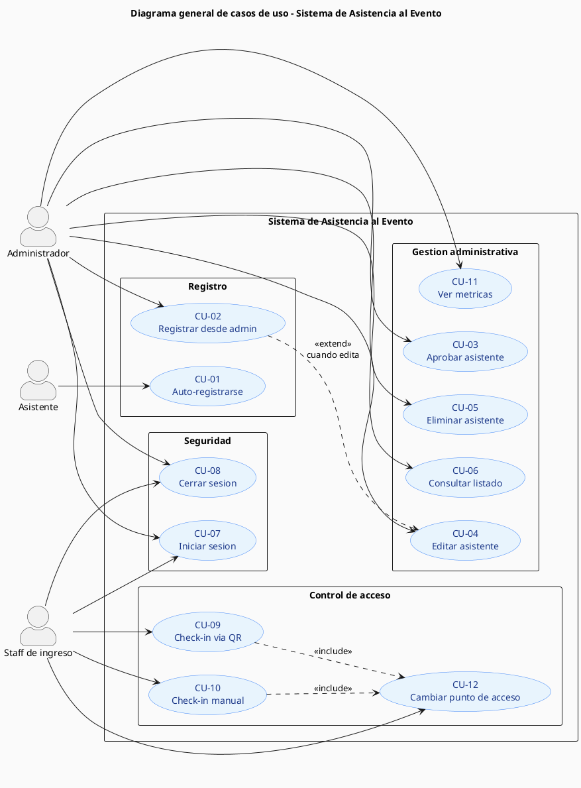
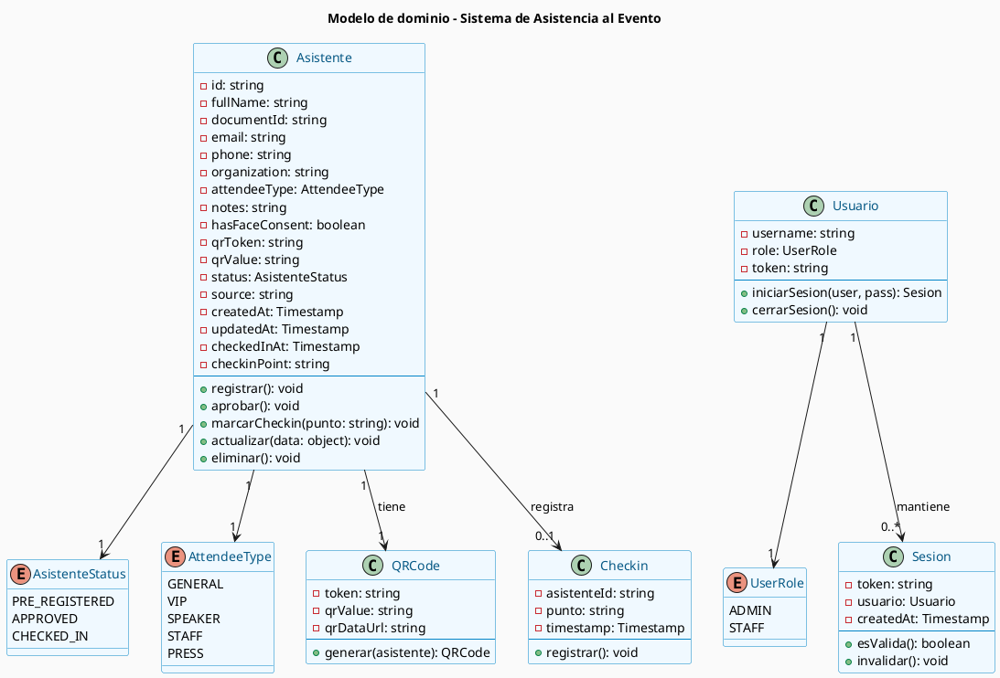
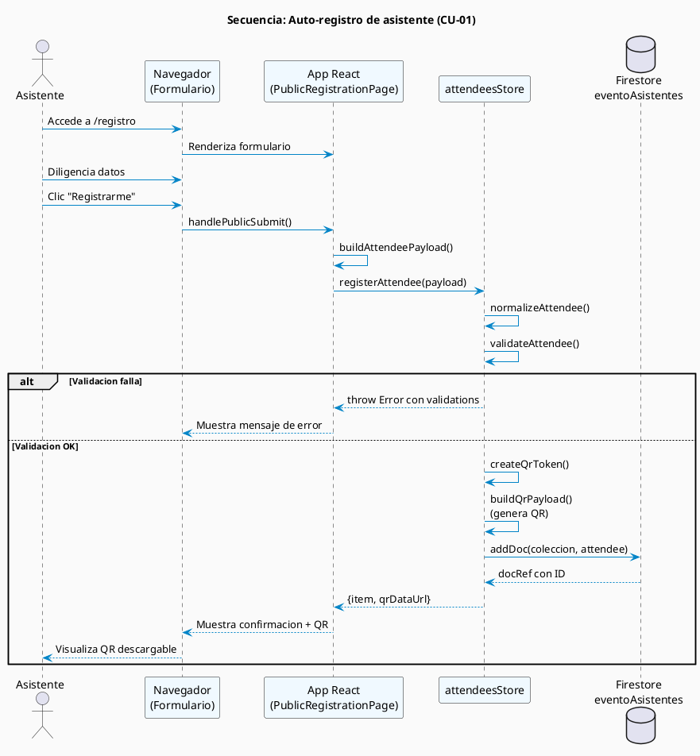
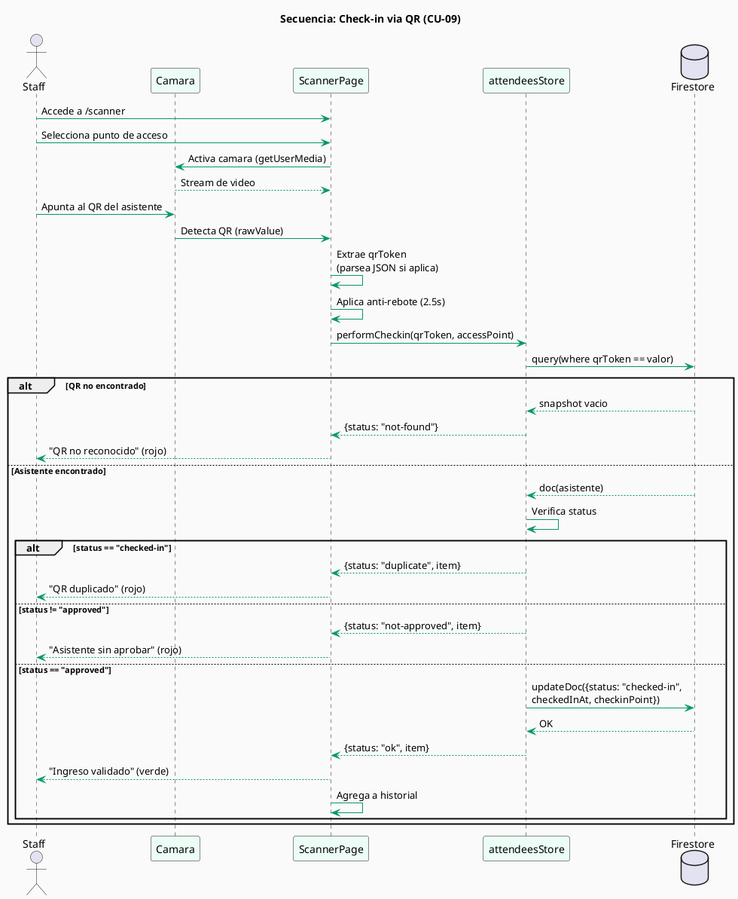
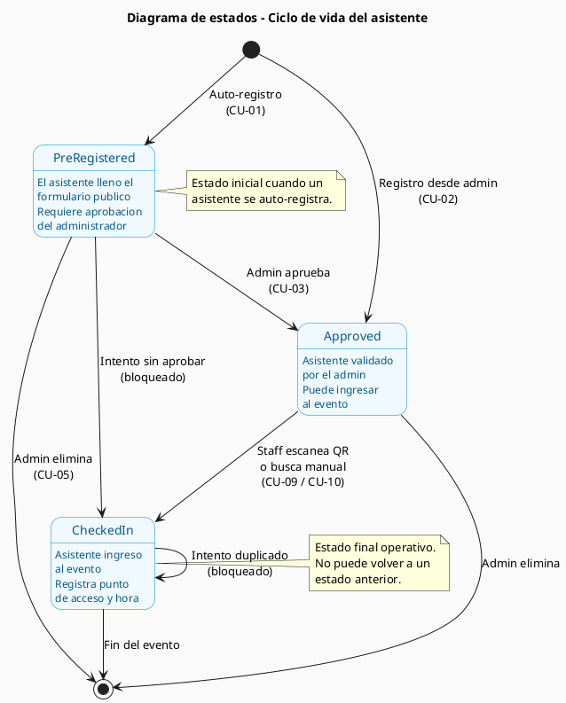
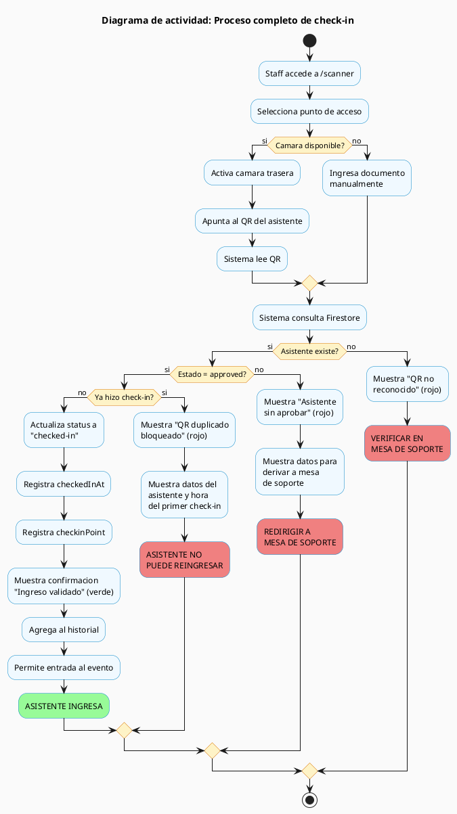
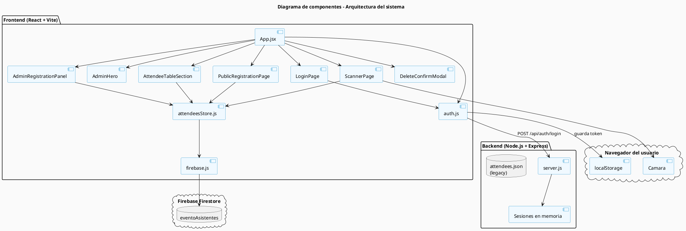

# Especificación de Requisitos de Software (SRS)

## Sistema de Registro y Control de Asistencia para Eventos

**Documento basado en el estándar IEEE 830-1998**

---

| Atributo | Valor |
|---|---|
| Proyecto | asistencia-evento |
| Versión del documento | 1.0 |
| Fecha | Abril de 2026 |
| Institución | Corporación Unificada Nacional (CUN) |
| Autora | Andrea Ramírez |
| Estado | Borrador inicial |

---

## Tabla de contenido

1. Introducción
2. Descripción general
3. Requisitos específicos
4. Casos de uso
5. Diagramas UML
6. Cronograma del proyecto
7. Análisis de riesgos
8. Plan de pruebas
9. Glosario extendido
10. Anexos técnicos

---

## 1. Introducción

### 1.1 Propósito

Este documento describe los requisitos funcionales y no funcionales del **Sistema de Registro y Control de Asistencia para Eventos**, una aplicación web orientada a eventos de alta concurrencia (hasta 1.000 asistentes o más).

Está dirigido a:
- Equipo de desarrollo del proyecto.
- Equipo organizador del evento.
- Personal académico y administrativo de la CUN encargado de evaluar la solución.
- Personal de soporte técnico durante el evento.

### 1.2 Alcance del producto

El sistema permite:
- Registro previo (auto-registro) de asistentes desde celular o computador.
- Registro asistido por personal administrativo.
- Generación automática de un código QR único por asistente.
- Validación de ingreso mediante escaneo QR o búsqueda manual por documento.
- Aprobación de asistentes desde un panel administrativo.
- Bloqueo automático de duplicados o asistentes no aprobados.
- Visualización de métricas en tiempo real (totales, aprobados, check-ins, pendientes).
- Gestión de roles diferenciados (administrador y staff de ingreso).

El sistema **no incluye en esta versión**:
- Venta de boletas o procesamiento de pagos.
- Reconocimiento facial (planeado para futuras versiones).
- Envío automático de QR por correo o WhatsApp.
- Aplicaciones móviles nativas (iOS/Android).
- Vista para pantalla grande tipo kiosco (planeada).

### 1.3 Definiciones, acrónimos y abreviaturas

| Término | Definición |
|---|---|
| **Asistente** | Persona registrada en el sistema, candidata a ingresar al evento |
| **Check-in** | Acto de validar y confirmar el ingreso de un asistente |
| **QR** | Quick Response code, código bidimensional usado para identificar al asistente |
| **Admin** | Usuario con permisos completos sobre el sistema |
| **Staff** | Personal de ingreso, con permisos limitados al check-in |
| **Punto de acceso** | Ubicación física del evento donde se valida el ingreso (entrada norte, VIP, etc.) |
| **Pre-registro** | Estado inicial cuando el asistente se inscribe pero aún no ha sido aprobado |
| **Aprobado** | Estado en el que el asistente puede ingresar al evento |
| **Checked-in** | Estado final que indica que el asistente ya ingresó |
| **SRS** | Software Requirements Specification |
| **SPA** | Single Page Application |
| **API** | Application Programming Interface |
| **Firestore** | Base de datos NoSQL en la nube de Google Firebase |

### 1.4 Referencias

- IEEE 830-1998: *Recommended Practice for Software Requirements Specifications*.
- Documentación oficial de React, Vite, Firebase Firestore y Node.js.
- Repositorio del proyecto: directorio local `c:\Users\andrea_ramirezt\asistencia-evento`.

### 1.5 Resumen del documento

La sección 2 presenta una descripción general del producto, sus usuarios y restricciones. La sección 3 detalla los requisitos funcionales y no funcionales numerados. La sección 4 incluye anexos como el modelo de datos, los flujos principales y la arquitectura.

---

## 2. Descripción general

### 2.1 Perspectiva del producto

El sistema es una **aplicación web Single Page Application (SPA)** desarrollada en React con Vite, que se conecta a:
- **Firebase Firestore** como base de datos principal (colección `eventoAsistentes`).
- **Backend Node.js + Express** local, dedicado exclusivamente a la autenticación de roles administrativos.

Es accesible desde cualquier navegador moderno, tanto en computador como en dispositivos móviles. La arquitectura está pensada para que el frontend hable directamente con Firestore para operaciones de datos, garantizando escalabilidad y persistencia en la nube.

### 2.2 Funciones del producto

Las funciones principales se agrupan en cuatro módulos:

**Módulo de registro**
- Auto-registro público desde formulario web.
- Registro asistido desde panel administrativo.

**Módulo de control de acceso**
- Generación de código QR único.
- Validación de ingreso mediante escaneo o búsqueda manual.
- Bloqueo de duplicados y asistentes no aprobados.

**Módulo de administración**
- Listado y filtrado de asistentes.
- Aprobación, edición y eliminación de registros.
- Métricas en tiempo real.

**Módulo de seguridad**
- Login con roles diferenciados (admin/staff).
- Sesiones con token.

### 2.3 Características de los usuarios

| Tipo de usuario | Conocimiento técnico | Frecuencia de uso | Funcionalidades disponibles |
|---|---|---|---|
| **Asistente** | Ninguno requerido | Una sola vez | Auto-registro, recibir QR |
| **Staff de ingreso** | Básico | Continuo durante el evento | Scanner QR, búsqueda manual, check-in |
| **Administrador** | Medio | Antes y durante el evento | Acceso completo, aprobaciones, gestión, reportes |

### 2.4 Restricciones

- El sistema requiere **conexión a internet** para sincronizar con Firestore.
- El acceso a la cámara para el scanner QR requiere conexión **HTTPS** (excepto en `localhost` para desarrollo).
- Soporta navegadores modernos: Chrome 90+, Edge 90+, Safari 14+, Firefox 88+.
- La autenticación actual usa tokens almacenados en memoria del backend Node, por lo que reiniciar el backend cierra todas las sesiones.
- El proyecto Firebase es compartido con otras aplicaciones de la CUN, por lo que las reglas de seguridad deben respetar las colecciones existentes.

### 2.5 Suposiciones y dependencias

- Los asistentes tienen un dispositivo (celular o computador) con navegador para auto-registrarse.
- El staff cuenta con tablets o celulares con cámara para escanear los códigos QR.
- La conexión a internet en el sitio del evento es estable.
- Firebase Firestore está disponible y operativo durante el evento.
- Se cuenta con autorización institucional para usar el proyecto Firebase `desarrollo-investigaciones`.

---

## 3. Requisitos específicos

### 3.1 Requisitos de interfaces externas

#### 3.1.1 Interfaces de usuario

El sistema expone cuatro vistas principales:

| Ruta | Vista | Usuario objetivo |
|---|---|---|
| `/registro` | Formulario público de auto-registro | Asistente |
| `/admin` | Panel administrativo | Administrador |
| `/scanner` | Vista de escaneo QR | Staff de ingreso |
| `/admin/login` | Pantalla de inicio de sesión | Admin / staff |

Diseño responsive: las vistas se adaptan a celular, tablet y escritorio.

#### 3.1.2 Interfaces de hardware

- **Cámara de dispositivo** (celular, tablet o webcam) para el escaneo QR. Opcional: si no hay cámara, el sistema permite búsqueda manual por documento.

#### 3.1.3 Interfaces de software

- **Firebase Firestore**: almacenamiento de la colección `eventoAsistentes`.
- **Firebase SDK Web** (`firebase ^12.x`): cliente JavaScript para acceso a Firestore.
- **Backend Node.js + Express**: endpoints REST para autenticación.
- **Librería @yudiel/react-qr-scanner**: lectura de QR desde cámara.
- **Librería qrcode**: generación de imágenes QR.

#### 3.1.4 Interfaces de comunicación

- HTTPS para producción.
- HTTP en desarrollo local (`localhost`).
- WebRTC `getUserMedia` para acceso a cámara.

### 3.2 Requisitos funcionales

#### Módulo de registro

| ID | Requisito | Prioridad |
|---|---|---|
| RF-01 | El sistema debe permitir el auto-registro público de un asistente con los campos: nombre completo, documento, correo, teléfono, organización, categoría, autorización de reconocimiento facial. | Alta |
| RF-02 | El sistema debe permitir al administrador registrar un asistente desde el panel administrativo. | Alta |
| RF-03 | El sistema debe generar automáticamente un código QR único por cada asistente registrado. | Alta |
| RF-04 | El sistema debe asignar el estado `pre-registered` a los asistentes que se auto-registren. | Alta |
| RF-05 | El sistema debe asignar el estado `approved` a los asistentes registrados directamente por el administrador. | Alta |
| RF-06 | El sistema debe validar que los campos obligatorios (nombre, documento, teléfono) no estén vacíos. | Alta |
| RF-07 | El sistema debe mostrar el QR generado al asistente para descarga inmediata. | Media |

#### Módulo de control de acceso

| ID | Requisito | Prioridad |
|---|---|---|
| RF-08 | El sistema debe permitir el escaneo de códigos QR mediante la cámara del dispositivo. | Alta |
| RF-09 | El sistema debe permitir la búsqueda manual de asistentes por número de documento o token QR. | Alta |
| RF-10 | El sistema debe registrar la hora exacta y el punto de acceso en cada check-in. | Alta |
| RF-11 | El sistema debe bloquear el ingreso si el asistente ya hizo check-in (estado `checked-in`). | Alta |
| RF-12 | El sistema debe bloquear el ingreso si el asistente no ha sido aprobado (estado distinto a `approved`). | Alta |
| RF-13 | El sistema debe permitir seleccionar el punto de acceso antes del escaneo (entrada norte, sur, VIP, backstage). | Media |
| RF-14 | El sistema debe mostrar un historial visible de los últimos escaneos realizados. | Media |
| RF-15 | El sistema debe mostrar feedback visual diferenciado por color (verde: válido, rojo: bloqueado). | Alta |

#### Módulo de administración

| ID | Requisito | Prioridad |
|---|---|---|
| RF-16 | El sistema debe mostrar un listado completo de asistentes con paginación o scroll. | Alta |
| RF-17 | El sistema debe permitir filtrar el listado por nombre, documento, correo, categoría y estado. | Alta |
| RF-18 | El sistema debe permitir aprobar asistentes en estado `pre-registered`. | Alta |
| RF-19 | El sistema debe permitir editar la información de un asistente. | Media |
| RF-20 | El sistema debe permitir eliminar un asistente con confirmación previa. | Media |
| RF-21 | El sistema debe mostrar métricas en tiempo real: total registrados, aprobados, check-ins confirmados, pendientes. | Alta |

#### Módulo de seguridad

| ID | Requisito | Prioridad |
|---|---|---|
| RF-22 | El sistema debe permitir el inicio de sesión de usuarios admin y staff con usuario y contraseña. | Alta |
| RF-23 | El sistema debe diferenciar permisos por rol: admin con acceso completo, staff únicamente al scanner. | Alta |
| RF-24 | El sistema debe permitir cerrar sesión y limpiar el token local. | Alta |
| RF-25 | El sistema debe redirigir automáticamente al login cuando una petición sea rechazada por falta de autenticación. | Alta |

### 3.3 Requisitos no funcionales

| ID | Categoría | Requisito |
|---|---|---|
| RNF-01 | **Rendimiento** | El sistema debe soportar al menos 1.000 asistentes registrados sin degradación notable. |
| RNF-02 | **Rendimiento** | El tiempo de respuesta para registrar un asistente no debe exceder 2 segundos en condiciones normales de red. |
| RNF-03 | **Rendimiento** | El check-in (validación de QR) no debe exceder 1.5 segundos. |
| RNF-04 | **Disponibilidad** | El sistema debe estar disponible al menos el 99% del tiempo durante las horas activas del evento. |
| RNF-05 | **Seguridad** | Las operaciones administrativas deben requerir token de autenticación válido. |
| RNF-06 | **Seguridad** | Las credenciales de Firebase no deben commitearse al repositorio (uso de `.env.local`). |
| RNF-07 | **Seguridad** | Las contraseñas de admin/staff deben configurarse mediante variables de entorno, no hardcodeadas. |
| RNF-08 | **Usabilidad** | La interfaz debe ser comprensible para usuarios sin conocimiento técnico previo. |
| RNF-09 | **Usabilidad** | Las vistas deben ser responsive y funcionar correctamente en pantallas desde 360px hasta 1920px de ancho. |
| RNF-10 | **Compatibilidad** | El sistema debe funcionar en navegadores modernos (Chrome, Edge, Safari, Firefox en sus versiones recientes). |
| RNF-11 | **Mantenibilidad** | El código debe estar separado en módulos: store de datos, componentes UI, autenticación, configuración. |
| RNF-12 | **Mantenibilidad** | Las llamadas a Firestore deben centralizarse en un único módulo (`attendeesStore.js`). |
| RNF-13 | **Escalabilidad** | El uso de Firestore como base de datos garantiza escalabilidad horizontal automática. |
| RNF-14 | **Trazabilidad** | Cada check-in debe registrar fecha, hora y punto de acceso. |
| RNF-15 | **Internacionalización** | Toda la interfaz debe estar en español, sin caracteres especiales acentuados problemáticos en formularios. |

### 3.4 Restricciones de diseño

- Frontend desarrollado en **React 19** con **Vite 8**.
- Backend desarrollado en **Node.js + Express 5**.
- Base de datos en **Firebase Firestore** (proyecto `desarrollo-investigaciones`).
- Estilos en CSS plano sin librerías de diseño externas.
- Sin uso de TypeScript en esta versión.

---

## 4. Casos de uso

### 4.1 Identificación de actores

Los actores del sistema se clasifican en humanos (usuarios finales) y de sistema (componentes externos que interactúan con el software).

#### Actores humanos

| ID | Actor | Descripción | Tipo de acceso | Casos de uso asociados |
|---|---|---|---|---|
| **A-01** | Asistente | Persona externa que desea participar en el evento. No requiere cuenta ni autenticación. | Público, sin login | CU-01 |
| **A-02** | Administrador | Organizador del evento con permisos completos sobre el sistema. Gestiona aprobaciones, asistentes y reportes. | Autenticado con rol `admin` | CU-02, CU-03, CU-04, CU-05, CU-06, CU-07, CU-08, CU-09, CU-10, CU-11, CU-12 |
| **A-03** | Staff de ingreso | Personal del evento responsable del control de acceso en las puertas. Usa tablets o celulares para escanear códigos QR. | Autenticado con rol `staff` | CU-07, CU-08, CU-09, CU-10, CU-12 |

#### Actores de sistema

| ID | Actor | Descripción |
|---|---|---|
| **A-04** | Firebase Firestore | Base de datos NoSQL en la nube donde se persisten todos los registros de la colección `eventoAsistentes`. Actor secundario en todos los casos de uso que requieren persistencia. |
| **A-05** | Backend Node.js | Servicio local responsable de validar credenciales y emitir tokens de sesión. Actor secundario en CU-07 y CU-08. |
| **A-06** | Cámara del dispositivo | Hardware del cliente que captura imágenes para la lectura del código QR. Actor secundario en CU-09. |

### 4.2 Diagrama de casos de uso

Representación textual del diagrama de casos de uso del sistema:

```
                    ┌──────────────────────────────────────────────┐
                    │       SISTEMA DE ASISTENCIA AL EVENTO        │
                    │                                              │
                    │  ┌────────────────────────────────────────┐  │
   (A-01)           │  │  CU-01: Auto-registrarse              │  │
   Asistente ──────────►│         (publico, sin login)          │  │
                    │  └────────────────────────────────────────┘  │
                    │                                              │
                    │  ┌────────────────────────────────────────┐  │
                    │  │  CU-07: Iniciar sesion                │  │
   (A-02)        ──────►│  CU-08: Cerrar sesion                 │◄────── (A-03)
   Administrador     │  └────────────────────────────────────────┘  │      Staff
                    │                                              │
                    │  ┌────────────────────────────────────────┐  │
                    │  │  CU-02: Registrar asistente (admin)   │  │
                    │  │  CU-03: Aprobar asistente             │  │
                    │  │  CU-04: Editar asistente              │  │
                    │  │  CU-05: Eliminar asistente            │  │
                    │──►│  CU-06: Consultar listado             │  │
                    │  │  CU-11: Ver metricas en tiempo real   │  │
                    │  └────────────────────────────────────────┘  │
                    │                                              │
                    │  ┌────────────────────────────────────────┐  │
                    │  │  CU-09: Check-in via QR               │  │
                    │  │  CU-10: Check-in via busqueda manual  │◄────── (A-03)
                    │  │  CU-12: Cambiar punto de acceso       │  │      Staff
                    │  └────────────────────────────────────────┘  │
                    │                                              │
                    └──────────────────────────────────────────────┘
                                          │
                                          │ <<incluye>> persistencia
                                          ▼
                                  ┌───────────────┐
                                  │     A-04      │
                                  │   Firestore   │
                                  └───────────────┘
```

### 4.3 Descripción detallada de casos de uso

Cada caso de uso se describe usando la siguiente plantilla:

| Campo | Significado |
|---|---|
| **ID** | Identificador único |
| **Nombre** | Descripción corta de la funcionalidad |
| **Actor principal** | Quien inicia el caso |
| **Actores secundarios** | Otros actores involucrados |
| **Descripción** | Resumen del propósito |
| **Precondiciones** | Estado del sistema antes de ejecutar |
| **Postcondiciones** | Estado del sistema después de ejecutar exitosamente |
| **Flujo principal** | Secuencia de pasos del camino feliz |
| **Flujos alternativos** | Variaciones válidas del flujo principal |
| **Excepciones** | Errores y situaciones inesperadas |
| **Reglas de negocio** | Restricciones del dominio aplicables |
| **Requisitos asociados** | Requisitos funcionales que cubre |
| **Frecuencia esperada** | Cuántas veces ocurre |
| **Prioridad** | Importancia para el sistema |

---

#### CU-01: Auto-registrarse como asistente

| Campo | Detalle |
|---|---|
| **ID** | CU-01 |
| **Nombre** | Auto-registrarse como asistente |
| **Actor principal** | A-01 Asistente |
| **Actores secundarios** | A-04 Firebase Firestore |
| **Descripción** | Permite a una persona externa registrarse al evento mediante un formulario web público y obtener su código QR de ingreso. |
| **Precondiciones** | 1. La aplicación está disponible en internet.<br>2. El asistente cuenta con conexión y un dispositivo con navegador. |
| **Postcondiciones** | 1. Existe un nuevo documento en la colección `eventoAsistentes` con estado `pre-registered`.<br>2. Se generó un código QR único asociado al asistente.<br>3. El asistente visualiza y puede descargar su QR. |

**Flujo principal**

| Paso | Actor | Acción |
|---|---|---|
| 1 | Asistente | Accede a la URL `/registro` desde su dispositivo. |
| 2 | Sistema | Muestra el formulario público con los campos requeridos. |
| 3 | Asistente | Diligencia los campos: nombre completo, documento, correo, teléfono, organización, categoría y consentimientos. |
| 4 | Asistente | Hace clic en el botón "Registrarme". |
| 5 | Sistema | Valida que los campos obligatorios (nombre, documento, teléfono) no estén vacíos. |
| 6 | Sistema | Genera un token QR único usando `crypto.randomUUID`. |
| 7 | Sistema | Envía el documento a Firestore con `status: "pre-registered"` y `source: "public-registration"`. |
| 8 | Firestore | Persiste el documento y devuelve el ID asignado. |
| 9 | Sistema | Genera la imagen del código QR a partir del token y los datos del asistente. |
| 10 | Sistema | Muestra la confirmación con el QR descargable y los datos del registro. |

**Flujos alternativos**

- **FA-01.1: Datos incompletos**
  - En el paso 5, si algún campo obligatorio está vacío, el sistema muestra un mensaje de error y no envía la petición. El asistente debe completar la información y reintentar.

**Excepciones**

- **EX-01.1: Sin conexión a internet**
  - En el paso 7, si no hay conectividad, el sistema muestra "No fue posible completar tu registro. Intenta nuevamente". El registro no se persiste.
- **EX-01.2: Reglas de Firestore rechazan la escritura**
  - El sistema muestra "Missing or insufficient permissions". El registro no se persiste.

**Reglas de negocio**

- **RN-01:** Todo asistente que se auto-registre arranca en estado `pre-registered` y debe ser aprobado posteriormente por un administrador antes de poder ingresar al evento.
- **RN-02:** El campo `documentId` no es validado como único en esta versión; podrían existir duplicados que el admin debe gestionar manualmente.

| Atributo | Valor |
|---|---|
| **Requisitos asociados** | RF-01, RF-03, RF-04, RF-06, RF-07 |
| **Frecuencia esperada** | Hasta 1.000 ejecuciones en las 48 horas previas al evento |
| **Prioridad** | Alta |

---

#### CU-02: Registrar asistente desde panel administrativo

| Campo | Detalle |
|---|---|
| **ID** | CU-02 |
| **Nombre** | Registrar asistente desde panel administrativo |
| **Actor principal** | A-02 Administrador |
| **Actores secundarios** | A-04 Firebase Firestore |
| **Descripción** | Permite al administrador o personal de mesa de soporte crear un asistente directamente desde el panel administrativo, generalmente para casos VIP, prensa, invitados de última hora o correcciones. |
| **Precondiciones** | 1. El administrador inició sesión con rol `admin`.<br>2. El sistema muestra el panel `/admin`. |
| **Postcondiciones** | 1. Existe un nuevo documento en `eventoAsistentes` con estado `approved`.<br>2. Se generó un código QR único.<br>3. El registro aparece en la tabla del panel. |

**Flujo principal**

| Paso | Actor | Acción |
|---|---|---|
| 1 | Administrador | Hace clic en el enlace "Registrar desde admin" del hero. |
| 2 | Sistema | Posiciona el scroll en el formulario de "Registro directo desde el panel del administrador". |
| 3 | Administrador | Diligencia los campos del formulario, incluyendo notas internas opcionales. |
| 4 | Administrador | Hace clic en "Crear registro y QR". |
| 5 | Sistema | Valida los campos obligatorios. |
| 6 | Sistema | Genera token QR único. |
| 7 | Sistema | Envía a Firestore con `status: "approved"` y `source: "admin-panel"`. |
| 8 | Firestore | Persiste el documento. |
| 9 | Sistema | Muestra el QR generado y agrega el asistente al inicio del listado en pantalla. |

**Flujos alternativos**

- **FA-02.1: Edición de asistente existente**
  - Si el campo `editingAttendeeId` está activo, el flujo se desvía: el sistema actualiza el documento existente en lugar de crear uno nuevo (ver CU-04).

**Excepciones**

- **EX-02.1: Sesión expirada**
  - Si el token de admin no es válido, el sistema redirige automáticamente a `/admin/login`.
- **EX-02.2: Validación falla**
  - Mensaje de error visible junto al formulario; los datos no se persisten.

**Reglas de negocio**

- **RN-03:** Los asistentes creados por el administrador quedan automáticamente aprobados y no requieren paso adicional de aprobación.
- **RN-04:** Solo los usuarios con rol `admin` pueden ejecutar este caso de uso.

| Atributo | Valor |
|---|---|
| **Requisitos asociados** | RF-02, RF-03, RF-05, RF-06 |
| **Frecuencia esperada** | Decenas de ejecuciones por evento |
| **Prioridad** | Alta |

---

#### CU-03: Aprobar asistente pre-registrado

| Campo | Detalle |
|---|---|
| **ID** | CU-03 |
| **Nombre** | Aprobar asistente pre-registrado |
| **Actor principal** | A-02 Administrador |
| **Actores secundarios** | A-04 Firebase Firestore |
| **Descripción** | Cambia el estado de un asistente de `pre-registered` a `approved`, habilitándolo para ingresar al evento. |
| **Precondiciones** | 1. Existe al menos un asistente con estado `pre-registered`.<br>2. El administrador está autenticado. |
| **Postcondiciones** | 1. El asistente cambia su estado a `approved`.<br>2. Se actualiza el campo `updatedAt`. |

**Flujo principal**

| Paso | Actor | Acción |
|---|---|---|
| 1 | Administrador | Visualiza la tabla de asistentes en `/admin`. |
| 2 | Administrador | Localiza un asistente con estado `pre-registered`. |
| 3 | Administrador | Hace clic en el botón "Aprobar" de la fila correspondiente. |
| 4 | Sistema | Envía a Firestore la actualización del estado. |
| 5 | Firestore | Aplica el cambio y devuelve confirmación. |
| 6 | Sistema | Actualiza la fila visible en la tabla mostrando el nuevo estado `approved`. |

**Excepciones**

- **EX-03.1: Asistente ya no existe**
  - Si el documento fue eliminado entre la lectura y la actualización, Firestore retorna error y el sistema muestra mensaje. Se recomienda refrescar la lista.

**Reglas de negocio**

- **RN-05:** Solo se pueden aprobar asistentes que estén actualmente en estado `pre-registered`. Otros estados no muestran el botón "Aprobar".
- **RN-06:** La aprobación es irreversible desde la UI; para revertir hay que editar el registro manualmente.

| Atributo | Valor |
|---|---|
| **Requisitos asociados** | RF-18 |
| **Frecuencia esperada** | Una vez por cada asistente pre-registrado |
| **Prioridad** | Alta |

---

#### CU-04: Editar información de un asistente

| Campo | Detalle |
|---|---|
| **ID** | CU-04 |
| **Nombre** | Editar información de un asistente |
| **Actor principal** | A-02 Administrador |
| **Actores secundarios** | A-04 Firebase Firestore |
| **Descripción** | Permite modificar los datos personales o categoría de un asistente existente. |
| **Precondiciones** | 1. El asistente existe en Firestore.<br>2. El administrador está autenticado. |
| **Postcondiciones** | 1. Los campos modificados se persisten en Firestore.<br>2. Se actualiza `updatedAt`. |

**Flujo principal**

| Paso | Actor | Acción |
|---|---|---|
| 1 | Administrador | Hace clic en el botón "Editar" de la fila del asistente. |
| 2 | Sistema | Carga los datos del asistente en el formulario y cambia el título a "Edición de asistente". |
| 3 | Administrador | Modifica los campos necesarios. |
| 4 | Administrador | Hace clic en "Guardar cambios". |
| 5 | Sistema | Valida los campos obligatorios. |
| 6 | Sistema | Envía la actualización a Firestore. |
| 7 | Firestore | Aplica los cambios. |
| 8 | Sistema | Actualiza la tabla y limpia el formulario. |

**Flujos alternativos**

- **FA-04.1: Cancelar edición**
  - El administrador hace clic en "Cancelar edición". El sistema descarta los cambios y vuelve al modo de creación.

**Reglas de negocio**

- **RN-07:** El `qrToken` no puede ser modificado; permanece fijo durante toda la vida del registro para preservar la validez del QR ya entregado al asistente.

| Atributo | Valor |
|---|---|
| **Requisitos asociados** | RF-19 |
| **Frecuencia esperada** | Esporádica |
| **Prioridad** | Media |

---

#### CU-05: Eliminar asistente

| Campo | Detalle |
|---|---|
| **ID** | CU-05 |
| **Nombre** | Eliminar asistente |
| **Actor principal** | A-02 Administrador |
| **Actores secundarios** | A-04 Firebase Firestore |
| **Descripción** | Elimina permanentemente un registro de asistente del sistema. |
| **Precondiciones** | 1. El asistente existe.<br>2. El administrador está autenticado. |
| **Postcondiciones** | El documento es removido de la colección `eventoAsistentes`. |

**Flujo principal**

| Paso | Actor | Acción |
|---|---|---|
| 1 | Administrador | Hace clic en "Eliminar" en la fila del asistente. |
| 2 | Sistema | Muestra modal de confirmación con los datos del asistente. |
| 3 | Administrador | Confirma la eliminación. |
| 4 | Sistema | Envía la operación de borrado a Firestore. |
| 5 | Firestore | Elimina el documento. |
| 6 | Sistema | Remueve la fila de la tabla y cierra el modal. |

**Flujos alternativos**

- **FA-05.1: Cancelar eliminación**
  - El administrador hace clic en "Cancelar" en el modal. El sistema cierra el modal sin realizar cambios.

**Excepciones**

- **EX-05.1: Asistente ya no existe**
  - Si fue eliminado por otro admin previamente, Firestore no genera error pero la fila local ya no debe aparecer al refrescar.

**Reglas de negocio**

- **RN-08:** La eliminación es permanente. No existe papelera ni opción de recuperar el registro.
- **RN-09:** Eliminar un asistente con check-in previo no afecta los reportes históricos en esta versión, pero sí elimina su trazabilidad individual.

| Atributo | Valor |
|---|---|
| **Requisitos asociados** | RF-20 |
| **Frecuencia esperada** | Esporádica |
| **Prioridad** | Media |

---

#### CU-06: Consultar y filtrar el listado de asistentes

| Campo | Detalle |
|---|---|
| **ID** | CU-06 |
| **Nombre** | Consultar y filtrar el listado de asistentes |
| **Actor principal** | A-02 Administrador |
| **Actores secundarios** | A-04 Firebase Firestore |
| **Descripción** | Permite al administrador visualizar todos los asistentes registrados y aplicar filtros por nombre, documento, correo, categoría y estado. |
| **Precondiciones** | El administrador está autenticado. |
| **Postcondiciones** | El sistema muestra el subconjunto de asistentes que cumplen los filtros aplicados. |

**Flujo principal**

| Paso | Actor | Acción |
|---|---|---|
| 1 | Administrador | Accede al panel `/admin`. |
| 2 | Sistema | Carga todos los asistentes desde Firestore ordenados por `createdAt` descendente. |
| 3 | Administrador | Escribe texto en el campo "Buscar" o selecciona valores en los desplegables "Categoría" y "Estado". |
| 4 | Sistema | Filtra el listado en memoria y actualiza la tabla en tiempo real. |
| 5 | Sistema | Muestra el contador "Coincidencias visibles". |

**Flujos alternativos**

- **FA-06.1: Refrescar lista manualmente**
  - El administrador hace clic en "Actualizar lista". El sistema vuelve a consultar Firestore.

**Reglas de negocio**

- **RN-10:** Los filtros son combinables (AND): un asistente debe cumplir todos los filtros activos para aparecer en la lista.
- **RN-11:** La búsqueda por texto compara contra `fullName`, `documentId` y `email` insensible a mayúsculas.

| Atributo | Valor |
|---|---|
| **Requisitos asociados** | RF-16, RF-17 |
| **Frecuencia esperada** | Constante durante el evento |
| **Prioridad** | Alta |

---

#### CU-07: Iniciar sesión

| Campo | Detalle |
|---|---|
| **ID** | CU-07 |
| **Nombre** | Iniciar sesión |
| **Actor principal** | A-02 Administrador o A-03 Staff |
| **Actores secundarios** | A-05 Backend Node.js |
| **Descripción** | Permite a un usuario administrativo o de staff autenticarse para acceder a las funcionalidades restringidas. |
| **Precondiciones** | 1. El usuario tiene credenciales válidas configuradas en el backend.<br>2. El backend está en ejecución y accesible. |
| **Postcondiciones** | 1. Se almacena un token de sesión en `localStorage`.<br>2. Se redirige al usuario según su rol: admin → `/admin`, staff → `/scanner`. |

**Flujo principal**

| Paso | Actor | Acción |
|---|---|---|
| 1 | Usuario | Accede a `/admin/login`. |
| 2 | Sistema | Muestra el formulario de credenciales. |
| 3 | Usuario | Ingresa usuario y contraseña. |
| 4 | Usuario | Hace clic en "Iniciar sesión". |
| 5 | Sistema | Envía credenciales al endpoint `POST /api/auth/login` del backend. |
| 6 | Backend | Compara con las variables de entorno `ADMIN_USER`/`ADMIN_PASSWORD` o `STAFF_USER`/`STAFF_PASSWORD`. |
| 7 | Backend | Genera un token aleatorio con `crypto.randomBytes(32)` y lo asocia al usuario en memoria. |
| 8 | Backend | Devuelve `{ token, user: { username, role } }`. |
| 9 | Sistema | Guarda token y user en `localStorage`. |
| 10 | Sistema | Redirige al usuario según el rol. |

**Excepciones**

- **EX-07.1: Credenciales inválidas**
  - El backend responde 401. El sistema muestra "Credenciales inválidas." y permite reintentar.
- **EX-07.2: Backend no disponible**
  - Error de red. El sistema muestra "No fue posible iniciar sesión." y conserva los campos diligenciados.

**Reglas de negocio**

- **RN-12:** Los tokens se almacenan en memoria del backend y se invalidan al reiniciar el servidor; todos los usuarios deben volver a loguearse en ese caso.
- **RN-13:** No hay límite de intentos fallidos en esta versión; se recomienda implementar rate limiting en futuras versiones.

| Atributo | Valor |
|---|---|
| **Requisitos asociados** | RF-22 |
| **Frecuencia esperada** | Una vez por usuario por sesión |
| **Prioridad** | Alta |

---

#### CU-08: Cerrar sesión

| Campo | Detalle |
|---|---|
| **ID** | CU-08 |
| **Nombre** | Cerrar sesión |
| **Actor principal** | A-02 Administrador o A-03 Staff |
| **Actores secundarios** | A-05 Backend Node.js |
| **Descripción** | Cierra la sesión del usuario actual e invalida su token. |
| **Precondiciones** | El usuario tiene una sesión activa. |
| **Postcondiciones** | 1. Token eliminado de `localStorage`.<br>2. Token invalidado en memoria del backend.<br>3. Usuario redirigido a `/admin/login`. |

**Flujo principal**

| Paso | Actor | Acción |
|---|---|---|
| 1 | Usuario | Hace clic en el botón "Cerrar sesión" del hero. |
| 2 | Sistema | Llama al endpoint `POST /api/auth/logout` con el token actual. |
| 3 | Backend | Elimina el token del `Map` de sesiones. |
| 4 | Sistema | Limpia `localStorage`. |
| 5 | Sistema | Redirige al login. |

**Excepciones**

- **EX-08.1: Backend no disponible**
  - La sesión local se cierra de todos modos para evitar dejar al usuario en un estado inconsistente.

| Atributo | Valor |
|---|---|
| **Requisitos asociados** | RF-24 |
| **Frecuencia esperada** | Una vez por sesión |
| **Prioridad** | Alta |

---

#### CU-09: Realizar check-in mediante escaneo QR

| Campo | Detalle |
|---|---|
| **ID** | CU-09 |
| **Nombre** | Realizar check-in mediante escaneo QR |
| **Actor principal** | A-03 Staff de ingreso |
| **Actores secundarios** | A-04 Firebase Firestore, A-06 Cámara del dispositivo |
| **Descripción** | Permite validar el ingreso de un asistente apuntando la cámara al código QR impreso o mostrado en pantalla. |
| **Precondiciones** | 1. El staff inició sesión.<br>2. El dispositivo tiene cámara funcional y el navegador tiene permiso de uso.<br>3. El asistente está en estado `approved`. |
| **Postcondiciones** | 1. El asistente cambia a estado `checked-in`.<br>2. Se registran `checkedInAt` y `checkinPoint`.<br>3. El staff visualiza confirmación verde en pantalla. |

**Flujo principal**

| Paso | Actor | Acción |
|---|---|---|
| 1 | Staff | Accede a `/scanner`. |
| 2 | Staff | Selecciona el punto de acceso (entrada norte, sur, VIP, backstage). |
| 3 | Sistema | Solicita permiso de cámara al navegador. |
| 4 | Navegador | Activa la cámara trasera del dispositivo. |
| 5 | Staff | Apunta la cámara al QR del asistente. |
| 6 | Sistema | Detecta el código QR y extrae el `qrToken`. |
| 7 | Sistema | Aplica anti-rebote: si el mismo token fue procesado en los últimos 2.5 segundos, se ignora. |
| 8 | Sistema | Consulta Firestore: `where qrToken == valor`. |
| 9 | Firestore | Devuelve el documento del asistente. |
| 10 | Sistema | Verifica que el estado sea `approved`. |
| 11 | Sistema | Actualiza el documento: `status: "checked-in"`, `checkedInAt: serverTimestamp()`, `checkinPoint: <punto>`. |
| 12 | Sistema | Muestra tarjeta verde "Ingreso validado" con datos del asistente. |
| 13 | Sistema | Agrega el evento al historial visible. |
| 14 | Staff | Hace clic en "Escanear siguiente asistente" para continuar. |

**Flujos alternativos**

- **FA-09.1: QR contiene JSON estructurado**
  - El sistema parsea el JSON y extrae el campo `token` antes de la consulta a Firestore.
- **FA-09.2: QR contiene solo el token**
  - El sistema usa el valor crudo como token directamente.

**Excepciones**

- **EX-09.1: QR no encontrado**
  - Firestore devuelve consulta vacía. Sistema muestra "QR no reconocido" en rojo.
- **EX-09.2: Asistente sin aprobar**
  - Estado distinto a `approved`. Sistema muestra "Asistente sin aprobar" y datos del asistente para que el staff lo derive a mesa de soporte.
- **EX-09.3: Check-in duplicado**
  - El asistente ya está en estado `checked-in`. Sistema muestra "QR duplicado bloqueado" en rojo con datos del asistente y hora original del primer check-in.
- **EX-09.4: Cámara no disponible o permiso denegado**
  - El sistema deshabilita el modo cámara y muestra "No se detectó cámara. Usa la entrada manual abajo." Permite usar CU-10 como respaldo.

**Reglas de negocio**

- **RN-14:** Solo asistentes en estado `approved` pueden ser marcados como `checked-in`.
- **RN-15:** Un asistente solo puede tener UN check-in. Cualquier intento posterior se considera duplicado.
- **RN-16:** El punto de acceso queda registrado de manera permanente y no puede modificarse después.
- **RN-17:** El anti-rebote de 2.5 segundos previene que el escaneo continuo del mismo QR genere lecturas múltiples.

| Atributo | Valor |
|---|---|
| **Requisitos asociados** | RF-08, RF-10, RF-11, RF-12, RF-13, RF-14, RF-15 |
| **Frecuencia esperada** | Hasta 1.000 ejecuciones durante las horas pico del evento |
| **Prioridad** | Alta |

---

#### CU-10: Realizar check-in mediante búsqueda manual

| Campo | Detalle |
|---|---|
| **ID** | CU-10 |
| **Nombre** | Realizar check-in mediante búsqueda manual |
| **Actor principal** | A-03 Staff de ingreso |
| **Actores secundarios** | A-04 Firebase Firestore |
| **Descripción** | Permite al staff validar el ingreso ingresando manualmente el documento o el token QR cuando la cámara no está disponible o el QR no es legible. |
| **Precondiciones** | 1. El staff inició sesión.<br>2. El asistente está en estado `approved`. |
| **Postcondiciones** | Mismas que CU-09. |

**Flujo principal**

| Paso | Actor | Acción |
|---|---|---|
| 1 | Staff | En `/scanner`, ubica el formulario "Búsqueda manual". |
| 2 | Staff | Escribe el número de documento o token QR del asistente. |
| 3 | Staff | Hace clic en "Validar ingreso manual". |
| 4 | Sistema | Detecta el tipo de entrada: si son solo dígitos (5 o más), lo trata como `documentId`; en caso contrario lo trata como `qrToken`. Si comienza con `{`, intenta parsear como JSON y extraer el token. |
| 5 | Sistema | Consulta Firestore: `where documentId == valor` o `where qrToken == valor`. |
| 6 | Firestore | Devuelve el documento del asistente. |
| 7 | Sistema | Aplica las mismas validaciones que CU-09 (estado, duplicado). |
| 8 | Sistema | Actualiza el estado y muestra confirmación. |

**Excepciones**

Mismas que CU-09, identificadas con prefijo EX-10.

**Reglas de negocio**

- **RN-18:** La búsqueda por documento espera coincidencia exacta. No hay tolerancia a errores tipográficos.
- **RN-19:** El staff debe verificar visualmente que el asistente coincide con la información mostrada antes de permitir el ingreso.

| Atributo | Valor |
|---|---|
| **Requisitos asociados** | RF-09, RF-10, RF-11, RF-12, RF-15 |
| **Frecuencia esperada** | Esporádica, principalmente como respaldo del CU-09 |
| **Prioridad** | Alta |

---

#### CU-11: Visualizar métricas en tiempo real

| Campo | Detalle |
|---|---|
| **ID** | CU-11 |
| **Nombre** | Visualizar métricas en tiempo real |
| **Actor principal** | A-02 Administrador |
| **Actores secundarios** | A-04 Firebase Firestore |
| **Descripción** | Muestra al administrador un resumen numérico actualizado del estado del evento: total de registros, aprobados, check-ins confirmados y pendientes. |
| **Precondiciones** | El administrador está autenticado y en `/admin`. |
| **Postcondiciones** | El hero del panel muestra cuatro tarjetas de métricas con valores calculados a partir del listado actual. |

**Flujo principal**

| Paso | Actor | Acción |
|---|---|---|
| 1 | Administrador | Visualiza el panel `/admin`. |
| 2 | Sistema | Calcula con `useMemo` los conteos a partir del array de asistentes en memoria. |
| 3 | Sistema | Renderiza las cuatro tarjetas: Total, Aprobados, Check-ins, Pendientes. |
| 4 | Administrador | Refresca la lista o realiza acciones; las métricas se recalculan automáticamente. |

**Reglas de negocio**

- **RN-20:** Las métricas se actualizan cada vez que cambia el array `attendees`. No requieren consulta adicional a Firestore.
- **RN-21:** Para tener métricas verdaderamente "en vivo" sin refrescar, en futuras versiones puede implementarse `onSnapshot` de Firestore.

| Atributo | Valor |
|---|---|
| **Requisitos asociados** | RF-21 |
| **Frecuencia esperada** | Permanente mientras el panel esté abierto |
| **Prioridad** | Media |

---

#### CU-12: Cambiar punto de acceso del scanner

| Campo | Detalle |
|---|---|
| **ID** | CU-12 |
| **Nombre** | Cambiar punto de acceso del scanner |
| **Actor principal** | A-03 Staff de ingreso |
| **Actores secundarios** | Ninguno |
| **Descripción** | Permite al staff cambiar el punto de acceso etiquetado para los próximos check-ins. |
| **Precondiciones** | El staff está en `/scanner`. |
| **Postcondiciones** | Los siguientes check-ins quedan registrados con el nuevo `checkinPoint`. |

**Flujo principal**

| Paso | Actor | Acción |
|---|---|---|
| 1 | Staff | Despliega el selector "Punto de acceso" en la cabecera. |
| 2 | Staff | Selecciona una opción: entrada norte, entrada sur, acceso VIP, backstage. |
| 3 | Sistema | Actualiza el estado local. |
| 4 | Sistema | Aplica el nuevo punto a todos los check-ins posteriores. |

**Reglas de negocio**

- **RN-22:** Cambiar el punto de acceso no afecta los check-ins ya registrados; solo aplica de ahí en adelante.

| Atributo | Valor |
|---|---|
| **Requisitos asociados** | RF-13 |
| **Frecuencia esperada** | Esporádica |
| **Prioridad** | Baja |

---

### 4.4 Matriz de trazabilidad: Casos de uso vs. Requisitos funcionales

| Caso de uso | Requisitos funcionales cubiertos |
|---|---|
| CU-01 Auto-registrarse | RF-01, RF-03, RF-04, RF-06, RF-07 |
| CU-02 Registrar desde admin | RF-02, RF-03, RF-05, RF-06 |
| CU-03 Aprobar asistente | RF-18 |
| CU-04 Editar asistente | RF-19 |
| CU-05 Eliminar asistente | RF-20 |
| CU-06 Consultar listado | RF-16, RF-17 |
| CU-07 Iniciar sesión | RF-22, RF-25 |
| CU-08 Cerrar sesión | RF-24 |
| CU-09 Check-in vía QR | RF-08, RF-10, RF-11, RF-12, RF-13, RF-14, RF-15 |
| CU-10 Check-in manual | RF-09, RF-10, RF-11, RF-12, RF-15 |
| CU-11 Visualizar métricas | RF-21 |
| CU-12 Cambiar punto de acceso | RF-13 |

### 4.5 Matriz de trazabilidad: Actores vs. Casos de uso

| Caso de uso | A-01 Asistente | A-02 Admin | A-03 Staff | A-04 Firestore | A-05 Backend | A-06 Cámara |
|---|:---:|:---:|:---:|:---:|:---:|:---:|
| CU-01 Auto-registrarse | ✓ |  |  | ✓ |  |  |
| CU-02 Registrar desde admin |  | ✓ |  | ✓ |  |  |
| CU-03 Aprobar |  | ✓ |  | ✓ |  |  |
| CU-04 Editar |  | ✓ |  | ✓ |  |  |
| CU-05 Eliminar |  | ✓ |  | ✓ |  |  |
| CU-06 Consultar |  | ✓ |  | ✓ |  |  |
| CU-07 Login |  | ✓ | ✓ |  | ✓ |  |
| CU-08 Logout |  | ✓ | ✓ |  | ✓ |  |
| CU-09 Check-in QR |  |  | ✓ | ✓ |  | ✓ |
| CU-10 Check-in manual |  |  | ✓ | ✓ |  |  |
| CU-11 Métricas |  | ✓ |  | ✓ |  |  |
| CU-12 Punto de acceso |  |  | ✓ |  |  |  |

---

## 5. Diagramas UML

Los diagramas de esta sección están escritos en **PlantUML**, una notación textual estándar de la industria que se renderiza como diagramas UML gráficos. Pueden visualizarse:

- **En línea:** pegando el código en [plantuml.com/plantuml](https://www.plantuml.com/plantuml/) o [planttext.com](https://www.planttext.com/).
- **En VSCode:** instalando la extensión *PlantUML* (autor: jebbs). Activar con `Alt+D`.
- **En Markdown renderizado:** algunas plataformas como GitHub o GitLab tienen soporte nativo o por plugins.
- **Exportar a imagen:** desde cualquiera de las herramientas anteriores se puede exportar a PNG o SVG para insertar en Word o PDF.

### 5.1 Diagrama de casos de uso

Muestra a los actores del sistema (los "muñequitos") y las relaciones con los casos de uso que pueden ejecutar, agrupados por módulos funcionales.



### 5.2 Diagrama de clases (modelo de dominio)

Representa las entidades principales del sistema, sus atributos, métodos y relaciones.



### 5.3 Diagrama de secuencia: Auto-registro público

Muestra la interacción paso a paso entre los componentes durante el auto-registro de un asistente.



### 5.4 Diagrama de secuencia: Check-in vía QR

Muestra la interacción durante el escaneo de un código QR y la validación del ingreso.



### 5.5 Diagrama de estados del asistente

Ilustra las transiciones válidas entre los estados de un asistente durante su ciclo de vida.



### 5.6 Diagrama de actividad: Flujo completo de check-in

Muestra el flujo de decisiones durante el proceso de check-in, incluyendo todos los caminos alternativos.



### 5.7 Diagrama de componentes (arquitectura de software)

Vista de alto nivel de los componentes del sistema y sus dependencias.



---

## 6. Cronograma del proyecto

### 6.1 Fases del proyecto

El proyecto está organizado en **cinco fases** secuenciales. Las fases 1 y 2 están completas, la fase 3 está implementada, y las fases 4 y 5 están parcialmente avanzadas.

| Fase | Nombre | Duración estimada | Estado | Fecha real/prevista |
|---|---|---|---|---|
| 1 | Base operativa | 3 días | ✅ Completa | Semana 1 |
| 2 | Registro y QR | 4 días | ✅ Completa | Semana 1-2 |
| 3 | Check-in | 3 días | ✅ Completa | Semana 2 |
| 4 | Dashboard y pantalla grande | 5 días | 🟡 Parcial | Semana 3 |
| 5 | Mejoras avanzadas | 7 días | 🔴 Pendiente | Semana 4 |

### 6.2 Desglose de tareas

| Fase | Tarea | Duración | Responsable | Estado |
|---|---|---|---|---|
| **1** | Configuración del entorno (React, Vite, Node.js) | 0.5 día | Dev | ✅ |
| 1 | Conexión inicial con Firebase | 0.5 día | Dev | ✅ |
| 1 | Estructura inicial de frontend y backend | 1 día | Dev | ✅ |
| 1 | Definición de colecciones y esquema de datos | 1 día | Dev | ✅ |
| **2** | Formulario de registro público | 1 día | Dev | ✅ |
| 2 | Formulario de registro administrativo | 1 día | Dev | ✅ |
| 2 | Integración con Firestore | 1 día | Dev | ✅ |
| 2 | Generación de código QR único | 0.5 día | Dev | ✅ |
| 2 | Panel de confirmación con QR descargable | 0.5 día | Dev | ✅ |
| **3** | Vista scanner con cámara | 1 día | Dev | ✅ |
| 3 | Endpoint de check-in con validaciones | 0.5 día | Dev | ✅ |
| 3 | Lógica anti-duplicados | 0.5 día | Dev | ✅ |
| 3 | Búsqueda manual como respaldo | 0.5 día | Dev | ✅ |
| 3 | Historial visible de escaneos | 0.5 día | Dev | ✅ |
| **4** | Panel de monitoreo administrativo | 1 día | Dev | ✅ |
| 4 | Métricas en tiempo real | 1 día | Dev | ✅ |
| 4 | Vista kiosco para pantalla grande | 2 días | Dev | 🔴 |
| 4 | Contadores e indicadores operativos | 1 día | Dev | 🔴 |
| **5** | Migración a Firebase Auth | 2 días | Dev | 🔴 |
| 5 | Despliegue en Firebase Hosting | 1 día | Dev | 🔴 |
| 5 | Exportación de reportes en CSV | 1 día | Dev | 🔴 |
| 5 | Reconocimiento facial opcional | 2 días | Dev | 🔴 |
| 5 | Pruebas integrales en dispositivos reales | 1 día | Dev | 🔴 |

### 6.3 Diagrama de Gantt simplificado

```
Semana 1       | Semana 2       | Semana 3       | Semana 4
│━━━━━━━━━━━━━━│━━━━━━━━━━━━━━━│━━━━━━━━━━━━━━━│━━━━━━━━━━━━━━━│
│ F1 │   F2    │      F3       │      F4       │      F5       │
│████│█████████│███████████████│███░░░░░░░░░░░│░░░░░░░░░░░░░░░│

Leyenda:
████ Completado
░░░░ Pendiente
```

### 6.4 Hitos del proyecto

| Hito | Descripción | Fecha esperada |
|---|---|---|
| H-01 | Primera versión funcional del registro | Fin semana 1 |
| H-02 | QR operativo end-to-end | Fin semana 2 |
| H-03 | Check-in con scanner funcionando | Mediados semana 2 |
| H-04 | Dashboard administrativo operativo | Mediados semana 3 |
| H-05 | Despliegue a producción | Fin semana 4 |
| H-06 | **Evento real en producción** | Por definir |

---

## 7. Análisis de riesgos

### 7.1 Matriz de riesgos

Los riesgos se clasifican por **probabilidad** (baja, media, alta) e **impacto** (bajo, medio, alto). El **nivel de riesgo** se calcula combinando ambos.

| ID | Riesgo | Probabilidad | Impacto | Nivel | Categoría |
|---|---|---|---|---|---|
| R-01 | Conexión a internet caída durante el evento | Media | Alto | **Alto** | Infraestructura |
| R-02 | Firestore rechaza escrituras por reglas de seguridad | Media | Alto | **Alto** | Seguridad |
| R-03 | Staff sin entrenamiento usa incorrectamente el scanner | Alta | Medio | **Alto** | Operativo |
| R-04 | Cámaras de dispositivos del staff no funcionan | Media | Medio | **Medio** | Hardware |
| R-05 | Asistentes pierden su código QR | Alta | Medio | **Alto** | Usuario |
| R-06 | Backend Node.js se cae durante el evento | Baja | Alto | **Medio** | Infraestructura |
| R-07 | Duplicados no detectados por diferencias de formato en documentos | Media | Medio | **Medio** | Datos |
| R-08 | Credenciales de admin/staff filtradas | Baja | Alto | **Medio** | Seguridad |
| R-09 | Pico de registros excede capacidad de Firestore (spike) | Baja | Medio | **Bajo** | Rendimiento |
| R-10 | Navegador del asistente no soporta la app | Baja | Medio | **Bajo** | Compatibilidad |
| R-11 | Dispositivos del staff sin batería durante el evento | Media | Medio | **Medio** | Logística |
| R-12 | Personas no registradas intentan ingresar | Alta | Bajo | **Medio** | Operativo |
| R-13 | Error humano al aprobar asistentes | Media | Medio | **Medio** | Proceso |
| R-14 | Datos del asistente ingresados con errores tipográficos | Alta | Bajo | **Medio** | Datos |

### 7.2 Plan de mitigación

| ID | Estrategia de mitigación | Responsable | Activación |
|---|---|---|---|
| R-01 | Disponer de un punto de acceso Wi-Fi de respaldo con proveedor alterno; staff capacitado para escribir documentos manualmente aunque falle la conexión y sincronizar después. | Organizador | Preventivo |
| R-02 | Probar todas las operaciones (registro, edición, aprobación, check-in) en ambiente de prueba antes del evento; tener un administrador del proyecto Firebase disponible el día del evento. | Dev | Preventivo |
| R-03 | Realizar capacitación al staff una semana antes; entregar guía rápida impresa con los pasos del check-in y los mensajes visuales esperados. | Dev + Organizador | Preventivo |
| R-04 | Habilitar siempre la búsqueda manual por documento como respaldo; asegurar que cada punto de acceso tenga al menos un dispositivo con cámara funcional validado previamente. | Organizador | Correctivo |
| R-05 | Implementar función de reimpresión o reenvío de QR desde el panel admin. Mesa de soporte puede buscar por documento y entregar QR nuevamente. | Staff / Admin | Correctivo |
| R-06 | Migrar la autenticación a Firebase Auth en la próxima versión para eliminar la dependencia del backend Node.js. Mientras tanto, el backend se puede reiniciar en menos de 30 segundos. | Dev | Correctivo |
| R-07 | Normalizar el campo `documentId` al guardar (eliminar espacios, puntos, guiones). Actualmente el sistema hace `.trim()` pero no elimina caracteres especiales. | Dev | Preventivo |
| R-08 | Cambiar credenciales por defecto (`admin123`, `staff123`) antes del evento. Usar claves únicas y rotarlas entre eventos. Nunca commitear el archivo `.env`. | Admin | Preventivo |
| R-09 | Firestore escala automáticamente. Si se anticipan picos masivos, solicitar aumento de cuota en la consola de Google Cloud previo al evento. | Dev | Preventivo |
| R-10 | Publicar los navegadores y versiones soportadas en la página del evento. Probar en al menos Chrome, Safari (iOS) y Edge antes del evento. | Dev | Preventivo |
| R-11 | Logística de baterías externas (power banks) para cada punto de acceso. Turnos rotativos para cargar dispositivos. | Organizador | Preventivo |
| R-12 | Mesa de soporte con permiso para registrar asistentes en el momento desde el panel admin (quedarán en estado `approved` y podrán ingresar inmediatamente). | Staff | Correctivo |
| R-13 | Todas las acciones de aprobación quedan registradas con `updatedAt`. Se puede revertir editando el registro. Capacitar al admin en el uso del listado con filtros. | Admin | Correctivo |
| R-14 | Implementar validaciones de formato en los inputs (solo números para documento, correos con `@`, etc.). Permitir al admin editar cualquier registro. | Dev | Preventivo |

---

## 8. Plan de pruebas

### 8.1 Objetivo

Verificar que el sistema cumple con los requisitos funcionales y no funcionales antes del evento en producción, garantizando una operación estable el día del evento.

### 8.2 Alcance

Se probarán los 12 casos de uso descritos en la sección 4, incluyendo flujos principales, alternativos y excepciones. Las pruebas se realizan en:

- Navegadores: Chrome, Edge, Safari, Firefox (últimas dos versiones).
- Dispositivos: computador de escritorio, tablet (Android/iOS), celular (Android/iOS).
- Red: conexión estable y conexión con latencia alta simulada.

### 8.3 Tipos de prueba

| Tipo | Descripción |
|---|---|
| **Funcional** | Verifica que cada caso de uso cumple su flujo principal y alternativos. |
| **Integración** | Verifica la comunicación entre frontend, backend y Firestore. |
| **Usabilidad** | Verifica que los usuarios sin entrenamiento pueden completar las tareas básicas. |
| **Compatibilidad** | Verifica el funcionamiento en diferentes navegadores y dispositivos. |
| **Rendimiento** | Verifica los tiempos de respuesta bajo carga simulada. |
| **Seguridad** | Verifica que los endpoints protegidos rechazan peticiones sin autenticación. |

### 8.4 Casos de prueba

#### CP-01: Auto-registro exitoso de asistente

| Campo | Valor |
|---|---|
| **ID** | CP-01 |
| **Caso de uso probado** | CU-01 |
| **Tipo** | Funcional |
| **Precondiciones** | Aplicación en línea; Firestore operativo |
| **Datos de entrada** | fullName="Juan Pérez", documentId="1032456789", email="juan@mail.com", phone="3001234567", organization="CUN", attendeeType="general" |
| **Pasos** | 1. Acceder a /registro<br>2. Diligenciar todos los campos<br>3. Clic en "Registrarme" |
| **Resultado esperado** | Documento creado en Firestore con status="pre-registered"; QR visible en pantalla; mensaje de éxito |
| **Prioridad** | Alta |

#### CP-02: Auto-registro con campos vacíos

| Campo | Valor |
|---|---|
| **ID** | CP-02 |
| **Caso de uso probado** | CU-01 (flujo alternativo FA-01.1) |
| **Tipo** | Funcional |
| **Precondiciones** | Aplicación en línea |
| **Datos de entrada** | fullName="" (vacío) |
| **Pasos** | 1. Acceder a /registro<br>2. Dejar nombre vacío<br>3. Clic en "Registrarme" |
| **Resultado esperado** | Validación HTML5 impide envío; mensaje "El nombre completo es obligatorio" |

#### CP-03: Registro desde admin con sesión activa

| Campo | Valor |
|---|---|
| **ID** | CP-03 |
| **Caso de uso probado** | CU-02 |
| **Tipo** | Funcional |
| **Precondiciones** | Admin autenticado |
| **Pasos** | 1. En /admin, diligenciar formulario<br>2. Clic "Crear registro y QR" |
| **Resultado esperado** | Asistente creado con status="approved"; aparece en tabla al inicio |

#### CP-04: Registro desde admin sin sesión

| Campo | Valor |
|---|---|
| **ID** | CP-04 |
| **Caso de uso probado** | CU-02 + CU-07 (guardia de ruta) |
| **Tipo** | Seguridad |
| **Pasos** | 1. Cerrar sesión<br>2. Intentar acceder a /admin |
| **Resultado esperado** | Redirección automática a /admin/login |

#### CP-05: Aprobación de asistente pre-registrado

| Campo | Valor |
|---|---|
| **ID** | CP-05 |
| **Caso de uso probado** | CU-03 |
| **Tipo** | Funcional |
| **Precondiciones** | Existe asistente en estado "pre-registered"; admin autenticado |
| **Pasos** | 1. Localizar asistente en tabla<br>2. Clic "Aprobar" |
| **Resultado esperado** | Estado cambia a "approved"; botón "Aprobar" desaparece de esa fila |

#### CP-06: Edición de asistente

| Campo | Valor |
|---|---|
| **ID** | CP-06 |
| **Caso de uso probado** | CU-04 |
| **Tipo** | Funcional |
| **Pasos** | 1. Clic "Editar" en una fila<br>2. Modificar email<br>3. Clic "Guardar cambios" |
| **Resultado esperado** | Email actualizado en Firestore y en la tabla |

#### CP-07: Eliminación con confirmación

| Campo | Valor |
|---|---|
| **ID** | CP-07 |
| **Caso de uso probado** | CU-05 |
| **Tipo** | Funcional |
| **Pasos** | 1. Clic "Eliminar"<br>2. Modal aparece<br>3. Clic "Confirmar" |
| **Resultado esperado** | Documento borrado de Firestore; fila removida |

#### CP-08: Cancelación de eliminación

| Campo | Valor |
|---|---|
| **ID** | CP-08 |
| **Caso de uso probado** | CU-05 (flujo alternativo FA-05.1) |
| **Tipo** | Funcional |
| **Pasos** | 1. Clic "Eliminar"<br>2. Clic "Cancelar" en modal |
| **Resultado esperado** | Modal se cierra; ningún cambio |

#### CP-09: Filtrado por nombre

| Campo | Valor |
|---|---|
| **ID** | CP-09 |
| **Caso de uso probado** | CU-06 |
| **Tipo** | Funcional |
| **Datos de entrada** | query="Juan" |
| **Pasos** | 1. Escribir "Juan" en el filtro "Buscar" |
| **Resultado esperado** | Solo se muestran filas con "Juan" en nombre, documento o correo |

#### CP-10: Login exitoso como admin

| Campo | Valor |
|---|---|
| **ID** | CP-10 |
| **Caso de uso probado** | CU-07 |
| **Datos de entrada** | username="admin", password="admin123" |
| **Resultado esperado** | Token almacenado en localStorage; redirección a /admin |

#### CP-11: Login con credenciales inválidas

| Campo | Valor |
|---|---|
| **ID** | CP-11 |
| **Caso de uso probado** | CU-07 (excepción EX-07.1) |
| **Datos de entrada** | username="admin", password="incorrecta" |
| **Resultado esperado** | Mensaje "Credenciales inválidas"; no hay redirección |

#### CP-12: Login como staff → scanner

| Campo | Valor |
|---|---|
| **ID** | CP-12 |
| **Caso de uso probado** | CU-07 |
| **Datos de entrada** | username="staff", password="staff123" |
| **Resultado esperado** | Redirección directa a /scanner; staff NO puede acceder a /admin |

#### CP-13: Check-in exitoso vía QR

| Campo | Valor |
|---|---|
| **ID** | CP-13 |
| **Caso de uso probado** | CU-09 |
| **Precondiciones** | Asistente en estado "approved"; dispositivo con cámara |
| **Pasos** | 1. Acceder a /scanner<br>2. Seleccionar "entrada-norte"<br>3. Apuntar cámara al QR |
| **Resultado esperado** | Tarjeta verde "Ingreso validado"; status cambia a "checked-in"; se registra checkedInAt y checkinPoint |

#### CP-14: Check-in duplicado bloqueado

| Campo | Valor |
|---|---|
| **ID** | CP-14 |
| **Caso de uso probado** | CU-09 (excepción EX-09.3) |
| **Precondiciones** | Asistente ya en estado "checked-in" |
| **Resultado esperado** | Tarjeta roja "QR duplicado bloqueado"; datos del primer check-in visibles; ningún cambio en Firestore |

#### CP-15: Check-in bloqueado por no aprobado

| Campo | Valor |
|---|---|
| **ID** | CP-15 |
| **Caso de uso probado** | CU-09 (excepción EX-09.2) |
| **Precondiciones** | Asistente en estado "pre-registered" |
| **Resultado esperado** | Tarjeta roja "Asistente sin aprobar"; mensaje sugiere derivar a mesa de soporte |

#### CP-16: Check-in manual por documento

| Campo | Valor |
|---|---|
| **ID** | CP-16 |
| **Caso de uso probado** | CU-10 |
| **Datos de entrada** | documentId="1032456789" |
| **Pasos** | 1. Escribir documento en búsqueda manual<br>2. Clic "Validar ingreso manual" |
| **Resultado esperado** | Mismo comportamiento que CP-13 si es válido |

#### CP-17: Cambio de punto de acceso

| Campo | Valor |
|---|---|
| **ID** | CP-17 |
| **Caso de uso probado** | CU-12 |
| **Pasos** | 1. Cambiar selector a "acceso-vip"<br>2. Hacer check-in a un asistente |
| **Resultado esperado** | El campo `checkinPoint` del asistente registra "acceso-vip" |

#### CP-18: Métricas reflejan estado real

| Campo | Valor |
|---|---|
| **ID** | CP-18 |
| **Caso de uso probado** | CU-11 |
| **Pasos** | 1. Crear un asistente<br>2. Observar la métrica "Registros totales" |
| **Resultado esperado** | La métrica se incrementa en 1 sin recargar la página |

#### CP-19: Cerrar sesión

| Campo | Valor |
|---|---|
| **ID** | CP-19 |
| **Caso de uso probado** | CU-08 |
| **Pasos** | 1. Clic "Cerrar sesión" |
| **Resultado esperado** | localStorage limpio; redirección a /admin/login |

#### CP-20: Rendimiento con 1000 asistentes

| Campo | Valor |
|---|---|
| **ID** | CP-20 |
| **Tipo** | Rendimiento |
| **Precondiciones** | Base de datos cargada con 1000 documentos |
| **Resultado esperado** | Tiempo de carga de /admin < 3 segundos; filtros responden < 500 ms |

### 8.5 Matriz de trazabilidad pruebas vs. casos de uso

| Caso de uso | Casos de prueba asociados |
|---|---|
| CU-01 | CP-01, CP-02 |
| CU-02 | CP-03, CP-04 |
| CU-03 | CP-05 |
| CU-04 | CP-06 |
| CU-05 | CP-07, CP-08 |
| CU-06 | CP-09, CP-20 |
| CU-07 | CP-10, CP-11, CP-12 |
| CU-08 | CP-19 |
| CU-09 | CP-13, CP-14, CP-15 |
| CU-10 | CP-16 |
| CU-11 | CP-18 |
| CU-12 | CP-17 |

### 8.6 Criterios de aceptación

El sistema se considera apto para producción cuando:

- ✅ 100% de los casos de prueba de prioridad alta pasan (CP-01, CP-03, CP-05, CP-10, CP-13, CP-14, CP-15).
- ✅ Al menos 90% de los casos de prueba totales pasan.
- ✅ No existen errores críticos conocidos sin resolver.
- ✅ Los tiempos de respuesta cumplen los requisitos no funcionales (RNF-02, RNF-03).
- ✅ Se ha probado en al menos tres dispositivos diferentes (escritorio, tablet, celular).

---

## 9. Glosario extendido

### 9.1 Términos del dominio

| Término | Definición |
|---|---|
| **Aforo** | Cantidad máxima de personas que pueden estar simultáneamente en un evento o espacio. |
| **Asistente** | Persona registrada en el sistema, candidata a ingresar al evento. |
| **Check-in** | Acto de validar y confirmar el ingreso de un asistente al evento. |
| **Credencial** | Identificación física o digital que valida la identidad de un asistente. |
| **Evento** | Actividad organizada con una fecha, hora y lugar específicos, a la cual asisten personas registradas. |
| **Lista de invitados** | Conjunto de asistentes aprobados para ingresar al evento. |
| **Mesa de soporte** | Puesto físico en el evento donde se resuelven incidencias con los asistentes. |
| **Pre-registro** | Inscripción previa al evento, sujeta a aprobación administrativa. |
| **Punto de acceso** | Ubicación física del evento donde se valida el ingreso (entrada principal, entrada VIP, etc.). |
| **QR (Quick Response)** | Código bidimensional que almacena información (en este caso, un token único del asistente). |
| **Staff** | Personal operativo del evento, incluyendo personal de ingreso, logística y soporte. |
| **Token** | Cadena única usada para identificar un asistente o una sesión de manera segura. |

### 9.2 Términos técnicos

| Término | Definición |
|---|---|
| **API (Application Programming Interface)** | Conjunto de reglas que permiten que diferentes aplicaciones se comuniquen entre sí. |
| **Bearer Token** | Tipo de token de autenticación que se envía en el encabezado HTTP `Authorization: Bearer <token>`. |
| **Colección** | Agrupación de documentos relacionados en Firestore. Equivalente aproximado a una "tabla" en bases de datos relacionales. |
| **CORS (Cross-Origin Resource Sharing)** | Mecanismo que permite que un servidor acepte peticiones de un dominio diferente al propio. |
| **CRUD** | Siglas de Create, Read, Update, Delete. Las cuatro operaciones básicas de persistencia de datos. |
| **Documento** | Unidad básica de almacenamiento en Firestore. Equivalente aproximado a una "fila" en SQL. |
| **Endpoint** | Una URL específica de una API que responde a peticiones HTTP. |
| **Express** | Framework web minimalista para Node.js usado para crear APIs REST. |
| **Firebase Auth** | Servicio de autenticación gestionado por Google, soporta login con correo, Google, Facebook, etc. |
| **Firebase Hosting** | Servicio de Google para desplegar sitios web estáticos y aplicaciones SPA con SSL gratis. |
| **Firestore** | Base de datos NoSQL orientada a documentos, en la nube, de Firebase. Ofrece sincronización en tiempo real. |
| **HTTPS** | Protocolo HTTP sobre TLS/SSL, cifrado y seguro. Requerido para producción y para acceso a cámara. |
| **JSON (JavaScript Object Notation)** | Formato ligero de intercambio de datos basado en pares clave-valor. |
| **localStorage** | Espacio de almacenamiento persistente en el navegador, asociado al dominio del sitio. |
| **NoSQL** | Tipo de base de datos no relacional. Firestore es un ejemplo. |
| **Node.js** | Entorno de ejecución de JavaScript del lado del servidor. |
| **REST (Representational State Transfer)** | Estilo arquitectónico para APIs web basado en recursos y métodos HTTP. |
| **SDK (Software Development Kit)** | Conjunto de herramientas, bibliotecas y documentación para desarrollar sobre una plataforma. |
| **Serverless** | Modelo de ejecución donde el proveedor gestiona la infraestructura. Firestore es un ejemplo. |
| **SPA (Single Page Application)** | Aplicación web que carga una sola página HTML y actualiza dinámicamente su contenido. |
| **Token de sesión** | Cadena única que representa una sesión activa de un usuario autenticado. |
| **UML (Unified Modeling Language)** | Lenguaje estándar para modelar sistemas de software con diagramas. |
| **UUID (Universally Unique Identifier)** | Identificador de 128 bits prácticamente único. Usado para `qrToken`. |
| **Vite** | Herramienta de desarrollo y bundler moderno para aplicaciones web, sucesor de Webpack. |
| **WebRTC** | Tecnología del navegador que permite capturar audio/video en tiempo real. Usada para acceder a la cámara. |

### 9.3 Estados y eventos del sistema

| Término | Definición |
|---|---|
| **approved** | Estado de un asistente que ha sido validado por un administrador y puede ingresar al evento. |
| **checked-in** | Estado final de un asistente que ya ingresó al evento. Se registra hora y punto de acceso. |
| **duplicate** | Resultado de un intento de check-in a un asistente que ya ingresó. |
| **invalid** | Resultado de una operación con datos insuficientes. |
| **not-approved** | Resultado de un intento de check-in a un asistente que no ha sido aprobado. |
| **not-found** | Resultado de una búsqueda que no encuentra al asistente. |
| **ok** | Resultado exitoso de una operación. |
| **pre-registered** | Estado inicial de un asistente que se auto-registró y está pendiente de aprobación. |

---

## 10. Anexos técnicos

### 10.1 Modelo de datos

**Colección Firestore: `eventoAsistentes`**

| Campo | Tipo | Descripción |
|---|---|---|
| `fullName` | string | Nombre completo del asistente |
| `documentId` | string | Número de documento único |
| `email` | string | Correo electrónico |
| `phone` | string | Teléfono de contacto |
| `organization` | string |   Empresa u organización (opcional) |
| `attendeeType` | string | Categoría: `general`, `vip`, `speaker`, `staff`, `press` |
| `notes` | string | Notas internas del administrador (opcional) |
| `hasFaceConsent` | boolean | Autorización para reconocimiento facial |
| `qrToken` | string | Token único usado en el QR |
| `qrValue` | string | Contenido completo del QR (JSON) |
| `status` | string | `pre-registered`, `approved`, `checked-in` |
| `source` | string | Origen del registro: `public-registration`, `admin-panel` |
| `createdAt` | timestamp | Fecha de creación |
| `updatedAt` | timestamp | Última modificación |
| `checkedInAt` | timestamp | Fecha y hora del check-in |
| `checkinPoint` | string | Punto de acceso usado en el check-in |

### 10.2 Estados del asistente

```
[pre-registered] ──Admin aprueba──> [approved] ──Staff escanea──> [checked-in]
                                       │
                                       └──Intento de re-escaneo──> [bloqueado: duplicado]
```

### 10.3 Arquitectura general

```
┌──────────────────────────────────────────────────────────────┐
│                    NAVEGADOR (Cliente)                        │
│                                                                │
│  ┌─────────────┐  ┌──────────────┐  ┌─────────────┐          │
│  │  /registro  │  │    /admin    │  │  /scanner   │          │
│  │  (público)  │  │ (admin only) │  │ (admin/staff)│         │
│  └──────┬──────┘  └──────┬───────┘  └──────┬──────┘          │
│         │                 │                  │                │
│         └─────────────────┼──────────────────┘                │
│                           │                                    │
└───────────────────────────┼────────────────────────────────────┘
                            │
              ┌─────────────┼─────────────┐
              ▼                           ▼
   ┌───────────────────┐      ┌───────────────────────┐
   │ Backend Node.js   │      │  Firebase Firestore   │
   │  - Login          │      │  - eventoAsistentes   │
   │  - Sesiones       │      │  (CRUD + check-in)    │
   └───────────────────┘      └───────────────────────┘
```

### 10.4 Flujos principales

**Flujo 1: Auto-registro de asistente**
1. Asistente accede a `/registro`.
2. Llena el formulario.
3. El sistema valida los campos.
4. Se crea un documento en Firestore con estado `pre-registered`.
5. Se genera y muestra el QR.

**Flujo 2: Aprobación administrativa**
1. Admin inicia sesión.
2. Visualiza la lista de asistentes en `/admin`.
3. Identifica los que están en estado `pre-registered`.
4. Hace clic en "Aprobar" → estado cambia a `approved`.

**Flujo 3: Check-in en el evento**
1. Staff inicia sesión y accede a `/scanner`.
2. Selecciona el punto de acceso.
3. Escanea el QR del asistente o ingresa su documento manualmente.
4. El sistema valida:
   - Si el asistente no existe → "QR no reconocido".
   - Si está en `pre-registered` → "Asistente sin aprobar".
   - Si está en `checked-in` → "QR duplicado bloqueado".
   - Si está en `approved` → cambia estado a `checked-in` y registra hora + punto.
5. Se muestra feedback visual y se actualiza el historial.

### 10.5 Pila tecnológica

| Componente | Tecnología | Versión |
|---|---|---|
| Frontend | React | 19.x |
| Bundler | Vite | 8.x |
| Backend | Node.js + Express | 5.x |
| Base de datos | Firebase Firestore | SDK 12.x |
| Generación QR | qrcode | 1.5.x |
| Lectura QR | @yudiel/react-qr-scanner | 2.5.x |

### 10.6 Roadmap de versiones futuras

| Versión | Funcionalidades |
|---|---|
| 1.1 | Migración de autenticación a Firebase Auth con cuentas `@cun.edu.co` |
| 1.2 | Despliegue en Firebase Hosting |
| 1.3 | Exportación de reportes en CSV |
| 1.4 | Vista kiosco para pantalla grande con aforo en vivo |
| 2.0 | Reconocimiento facial opcional como carril rápido |
| 2.1 | Notificaciones por correo o WhatsApp con QR adjunto |

---

**Fin del documento.**
